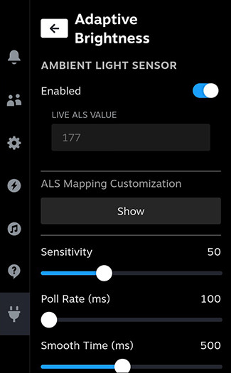

# Legion Go 2 Adaptive Brightness - Decky Plugin

[](https://github.com/jgudec/LegionGo2AdaptiveBrightness/releases)

A Decky plugin based on LegionGORemapper, specifically a stripped-down version of it with the sole purpose of enabling Adaptive Brightness for the Lenovo Legion GO 2.

### Why stripped down? 
Because e.g. Bazzite, with its integrated Handheld Daemon, already has fan curve/RGB/mapping control built into it, and LeggionGoRemapper's implementations were only clashing with HDD's ones...and I only cared about the Adaptive Brightness bit...

### What makes this fork different?

This fork:
- has updated and personally tweaked ALS value to brightness % mappings which align more with the Legion GO 2's panel and ALS sensor range of 0-1900 (I've set the mapping for the 0-1500 range)
- replaces the hardcoded mapping with a JSON file (`~/.homebrew/plugins/LegionGo2AdaptiveBrightness/brightness_thresholds.json`)
- offers customization of said mapping within the plugin's own UI

# Screenshots



# Functionality

The sole purpose of this plugin is functional and customizable Adaptive Brightness for the Lenovo Legion GO 2.

# Install Instructions

### Prerequisites

Decky Loader must already be installed.

### Quick Install / Update

Run the following in terminal, then reboot. Note that this works both for installing or updating the plugin

```
curl -L https://github.com/jgudec/LegionGo2AdaptiveBrightness/raw/main/install.sh | sh
```

### Manual Install

Download the latest release from the [releases page](https://github.com/jgudec/LegionGo2AdaptiveBrightness/releases)

Unzip the `tar.gz` file, and move the `LegionGo2AdaptiveBrightness` folder to your `~/homebrew/plugins` directory

then run:

```
sudo systemctl restart plugin_loader.service
```

then reboot your machine.

# Manual Build

- Node.js v16.14+ and pnpm installed

```bash
git clone https://github.com/jgudec/LegionGo2AdaptiveBrightness.git

cd LegionGo2AdaptiveBrightness

# if pnpm not already installed
npm install -g pnpm

pnpm install
pnpm update decky-frontend-lib --latest
pnpm run build
```

Afterwards, you can place the entire `LegionGo2AdaptiveBrightness` folder in the `~/homebrew/plugins` directly, then restart your plugin service

```bash
sudo systemctl restart plugin_loader.service

sudo systemctl reboot
```


# Attribution

Huge thanks to [aarron-lee](https://github.com/aarron-lee) for his [LegionGoRemapper](https://github.com/aarron-lee/LegionGoRemapper) project, with its initial and base functionality without which this plugin would not exist.

Special thanks to [antheas](https://github.com/antheas) for [reverse engineering and documenting the HID protocols](https://github.com/antheas/hwinfo/tree/master/devices/legion_go) for the Legion Go Controllers, etc.

Also special thanks to [corando98](https://github.com/corando98) for writing + testing the backend functions for talking to the HID devices, investigating fan curves, as well as contributing to the RGB light management code on the frontend.
